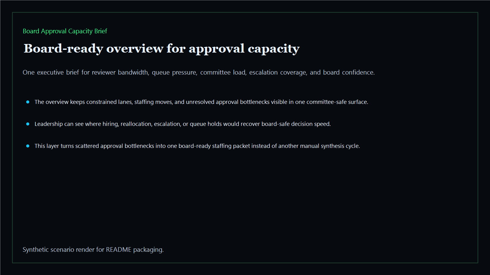
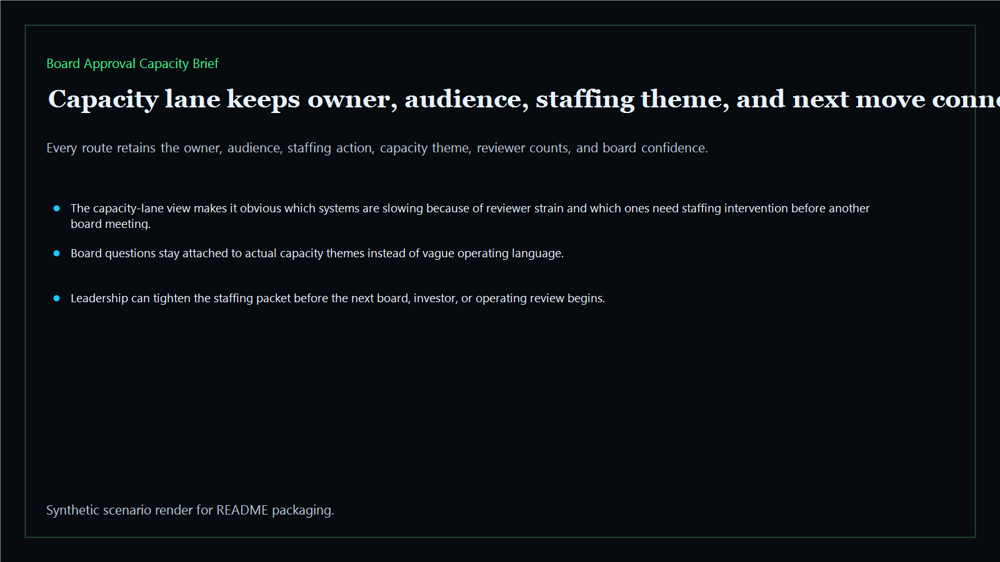
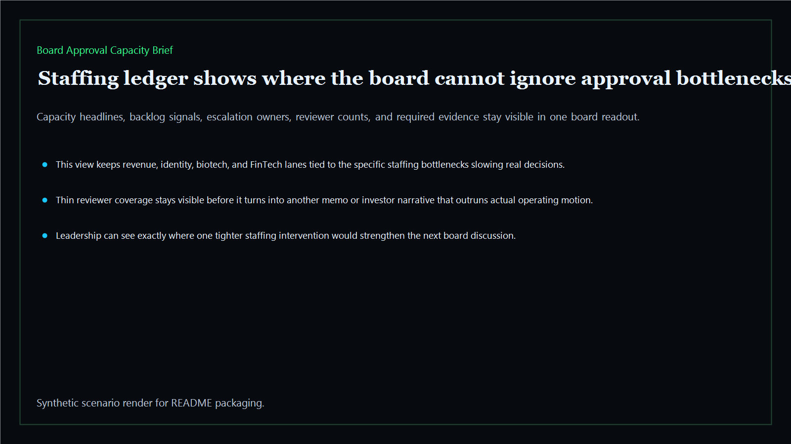
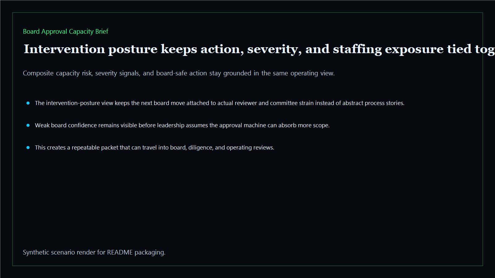

# Board Approval Capacity Brief

Board-ready approval capacity surface for reviewer bandwidth, committee throughput, escalation coverage, and decision-ready staffing tradeoffs across the executive estate.

- Live: `https://capacity.kineticgain.com/`
- Repo: `mizcausevic-dev/board-approval-capacity-brief`

## Why this matters

Leaders need more than queue visibility. They need one surface that shows where reviewer coverage, committee throughput, and escalation capacity are too thin to support the next board-backed move.

## What it includes

- TypeScript executive-intelligence surface for approval capacity with modeled reviewer lanes, staffing pressure, committee throughput, and board-safe intervention posture
- synthetic executive lanes across AI, identity, revenue, FinTech, biotech, procurement, and public-sector readiness
- reusable outputs for capacity briefs, staffing ledgers, intervention packets, and board-ready operating memos
- prerendered static site, JSON payloads, screenshots, and docs

## Routes

- `/`
- `/capacity-lane`
- `/staffing-ledger`
- `/intervention-posture`
- `/verification`
- `/docs`

## Local run

```bash
cd board-approval-capacity-brief
npm install
npm run verify
npm run prerender
npm run render:assets
```

## CLI

```bash
npx board-approval-capacity-brief fixtures/board-approval-capacity-brief.json --format summary
npx board-approval-capacity-brief fixtures/board-approval-capacity-brief-clean.json --format json
```

## Docs

- [Architecture](docs/architecture.md)
- [Origin](docs/ORIGIN.md)
- [Kinetic Gain Embedded](docs/KINETIC_GAIN_EMBEDDED.md)

## Screenshots





